# GAN Decks

A showcase of GAN generated skateboard deck graphics. Generated using the [Mantra deep learning framework](https://github.com/RJT1990/mantra/). 

Let me know which ones you like. I am going to get some of these printed in real life.

# Meet the Decks

## Africa

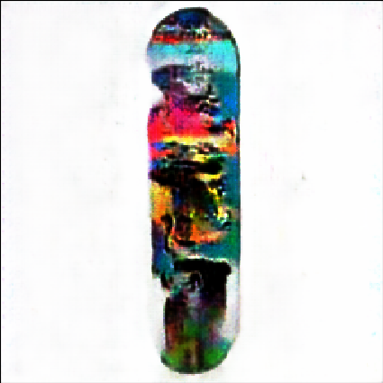

## Odyssey

## Camden

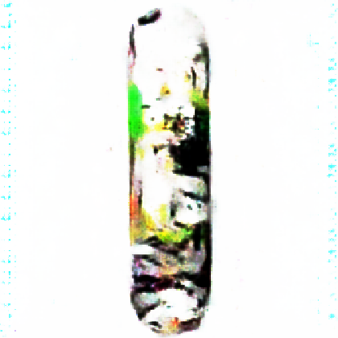

## Dante

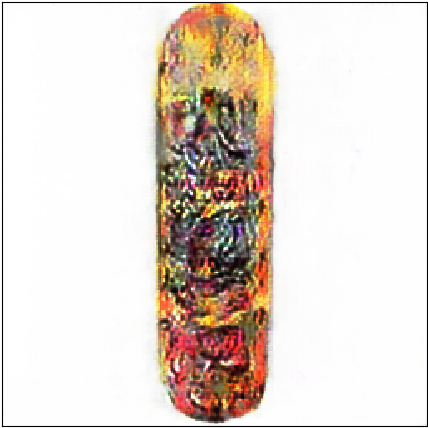

## 2049

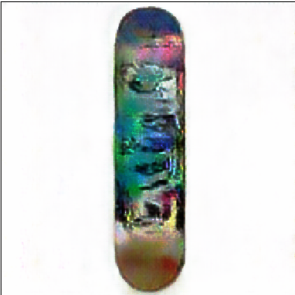

## Blanc

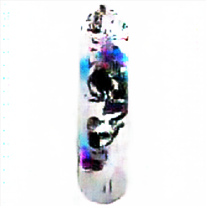

## Montezuma

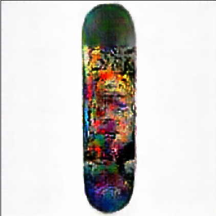

## Ra

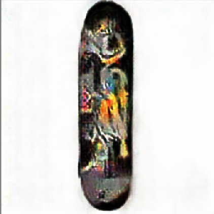

## Lignite

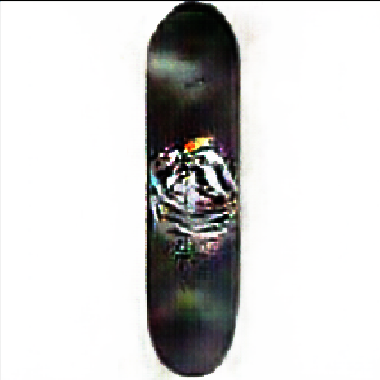

## Dover

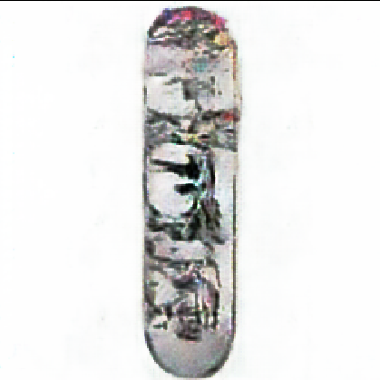

## Shaka

## Alaska (V1)

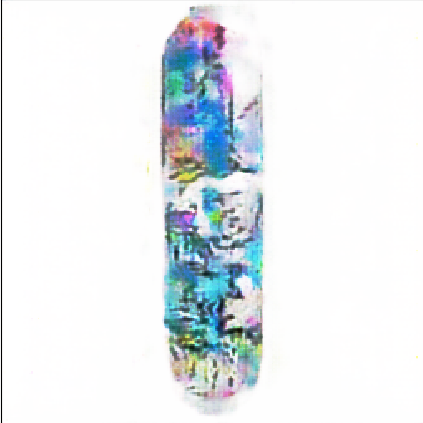

## Alaska (V2)

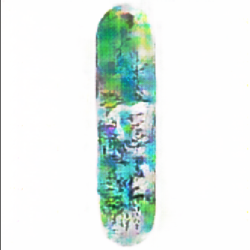

## Dorado

# Forged with Love using Mantra

