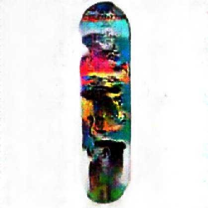
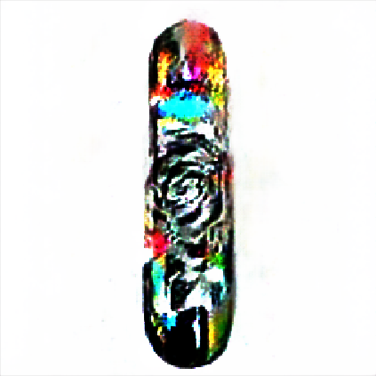
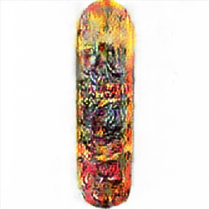
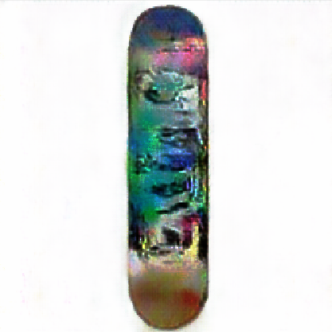
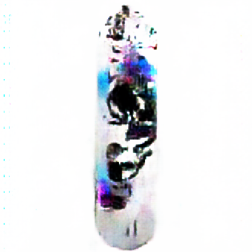
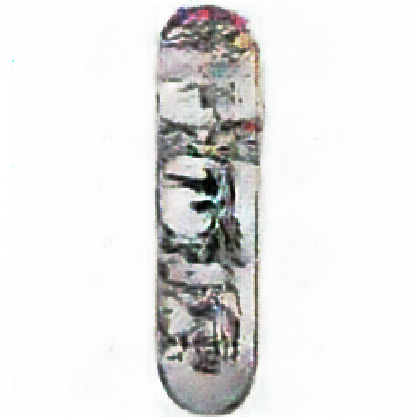
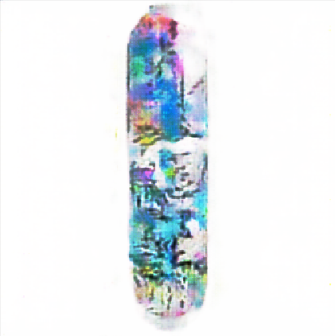
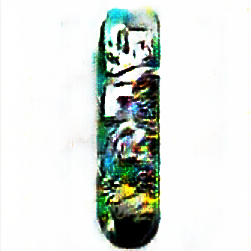

# GAN Decks

A showcase of GAN generated skateboard deck graphics. Generated using the [Mantra deep learning framework](https://github.com/RJT1990/mantra/). 


```console
mantra import https://github.com/RJT1990/gandecks
```

```console
mantra train relativistic_gan --dataset decks --image-dim 256 256
```

Let me know which ones you like. I am going to get some of these printed in real life.
<br><br>
<div align="center">

# Meet the Decks

## Africa


## Odyssey


## Camden


## Dante


## 2049


## Blanc


## Montezuma


## Ra


## Lignite


## Dover


## Shaka


## Alaska (V1)


## Alaska (V2)


## Dorado


# Forged with Love using Mantra


<br>


</div>
